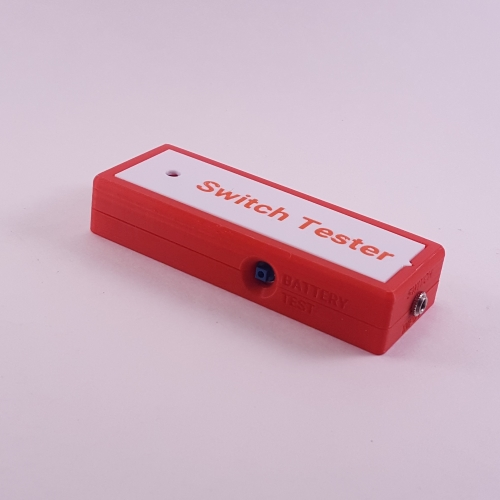

# Simple Switch Tester
The Simple Switch Tester is a cost effective, open source assistive technology for testing assistive switches. When an assistive switch is connected to the tester via the 3.5 mm jack and activated, a light on the tester will illuminate indicating that the switch is functioning correctly. The tester is powered by two AAA batteries. A test button on the side of the tester allows the batteries to be tested to confirm the tester is working correctly before testing a switch.

The Simple Switch Tester is comprised of off-the-shelf electronics and 3D printed parts. The overall cost of materials is about $8 (plus $8 for component shipping).

## More info at
 - [Makers Making Change Library Listing](https://www.makersmakingchange.com/s/product/simple-switch-tester/01tJR0000006948YAA) 

## Getting Started

### 1. Order the Off-The-Shelf Components

The [Bill of Materials](/Documentation/SST_BOM_v0.1.xlsx) lists all of the parts and components required to build the Simple Switch Tester. The electronic components may be available locally, but will probably need to be ordered online. For convenience, you can use this Digikey cart: https://www.digikey.ca/short/w37qmwmv

### 2. Print the 3D Printable components

Print the components for the switch tester case and choose an option for the case.

All of the files and individual print files can be in the [/Build_Files/3D_Printing_Files](/Build_Files/3D_Printing/) folder.

### 3. Assemble the Switch Tester

Reference the [assembly guide](/Documentation/SST_Assembly_Guide_v0.1.pdf) for the tools and steps required to build each portion. There is also a build video available at the following link: https://www.youtube.com/watch?v=CHm8Z5UD4Sw

## Files

### Documentation
| Document             | Version | Link                                                                                  |
|----------------------|---------|---------------------------------------------------------------------------------------|
| Design Specifications| 0.1     | [SST_Design_Specifications](/Documentation/SST_Design_Rationale_v0.1.pdf) |
| Design Rationale     | 0.1     | [SST_Design_Rationale](/Documentation/SST_Design_Rationale_v0.1.pdf) |
| Bill of Materials    | 0.1     | [SST_BOM](/Documentation/SST_BOM_v0.1.xlsx)                          |
| Assembly Guide       | 0.1     | [SST_Instructions](/Documentation/SST_Assembly_Guide_v0.1.pdf)       |
| Maker Checklist      | 0.1     | [SST_Checklist](/Documentation/SST_Maker_Checklist_v0.1.pdf)         |
| Quick Guide          | 0.1     | [SST_Quick_Guide](/Documentation/SST_Quick_Guide_v0.1.pdf)           |
| Changelog            | 0.1     | [SST_Changelog](/Documentation/SST_Changelog_v0.1.pdf)               |

### Design Files
 - [CAD Files](/Design_Files)

### Build Files
 - [3D Printing Files](/Build_Files/3D_Printing)
 - [V0.1 3MF](/Build_Files/3D_Printing/SST_All_v0.1.3mf)

## License

Everything needed or used to design, make, test, or prepare the Simple Switch Tester is licensed under the CERN 2.0 Permissive license <https://ohwr.org/project/cernohl/wikis/Documents/CERN-OHL-version-2> (CERN-OHL-P) .

Accompanying material such as instruction manuals, videos, and other copyrightable works that are useful but not necessary to design, make, test, or prepare the Simple Switch Tester are published under a Creative Commons Attribution-ShareAlike 4.0 license <https://creativecommons.org/licenses/by-sa/4.0/> (CC BY-SA 4.0)

<!-- ABOUT MMC START -->
## About Makers Making Change

Makers Making Change is a program of [Neil Squire](https://www.neilsquire.ca/), a Canadian non-profit that uses technology, knowledge, and passion to empower people with disabilities.

Makers Making Change leverages the capacity of community based Makers, Disability Professionals and Volunteers to develop and deliver affordable Open Source Assistive Technologies.

 - Website: [www.MakersMakingChange.com](https://www.makersmakingchange.com/)
 - GitHub: [makersmakingchange](https://github.com/makersmakingchange)
 - Bluesky: [@makersmakingchange.bsky.social](https://bsky.app/profile/makersmakingchange.bsky.social)
 - Instagram: [@makersmakingchange](https://www.instagram.com/makersmakingchange)
 - Facebook: [makersmakechange](https://www.facebook.com/makersmakechange)
 - LinkedIn: [Neil Squire Society](https://www.linkedin.com/company/neil-squire-society/)
 - Thingiverse: [makersmakingchange](https://www.thingiverse.com/makersmakingchange/about)
 - Printables: [MakersMakingChange](https://www.printables.com/@MakersMakingChange)

### Contact Us
For technical questions, to get involved, or to share your experience we encourage you to [visit our website](https://www.makersmakingchange.com/) or [contact us](https://www.makersmakingchange.com/s/contact).
<!-- ABOUT MMC END -->
